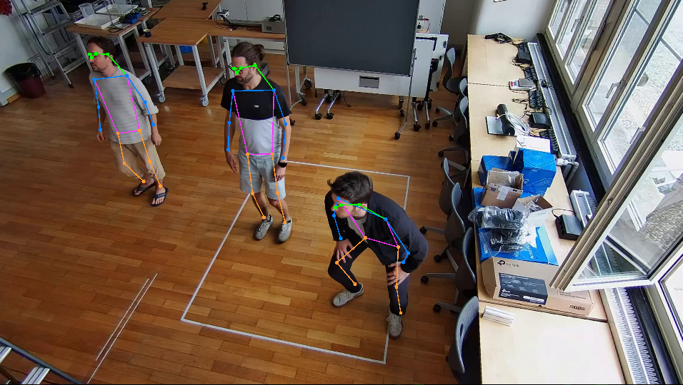
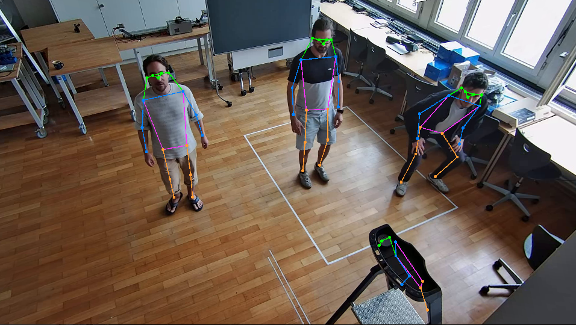
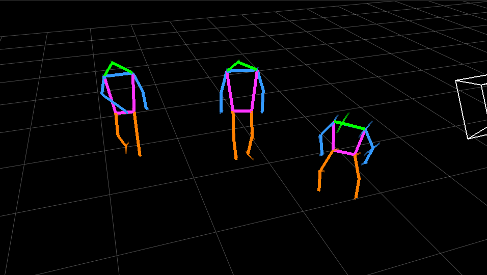

# MC3D-TRECSIM

MC3D-TRECSIM, or Multi-Camera 3D Trajectory Reconstruction for Enhanced Crowd Safety and Infrastructure Monitoring, is a system developed to improve surveillance tasks in crowded environments and automated infrastructures. It integrates data from multiple camera feeds to generate a comprehensive 3D representation of individuals, including their poses and positions. The system uses 2D pose estimation algorithms to extract spatial data, which are fused into accurate 3D reconstructions, allowing for precise tracking and prediction of the movements of multiple individuals. This innovation is aimed at enhancing crowd safety and monitoring the infrastructure in real-time.







## Table of Contents

1. [Installation](#installation)
    1. [Install Python Dependencies](#install-python-dependencies)
    2. [Install YoloV7 Pose Estimator](#install-yolov7-pose-estimator)
        1. [Download YOLOv7](#download-yolov7)
        2. [Install Dependencies](#install-dependencies)
        3. [Download Model](#download-model)
    3. [Install OpenCV with GStreamer](#install-opencv-with-gstreamer)
        1. [Download OpenCV and OpenCV-Contrib Sources](#download-opencv-and-opencv-contrib-sources)
        2. [Install Dependencies](#install-dependencies-1)
        3. [Build and Install OpenCV](#build-and-install-opencv)
    4. [Build MC3D-TRECSIM GMM](#build-mc3d-trecsim-gmm)
        1. [Building Python Bindings](#building-python-bindings)
        2. [Run C++ Unit Tests](#run-c-unit-tests)
        3. [Debug Testing](#debug-testing)
    5. [Adding Python Libraries to `PYTHONPATH`](#adding-python-libraries-to-pythonpath)
        1. [Using Anaconda](#using-anaconda)
        2. [Pure Python](#pure-python)
2. [Run MC3D-TRECSIM](#run-mc3d-trecsim)
3. [Calibration with MC-Calib](#calibration-with-mc-calib)
    1. [Install Docker on Ubuntu](#install-docker-on-ubuntu)
    2. [Install NVIDIA Container Toolkit](#install-nvidia-container-toolkit)
        1. [Prepare APT and Install](#prepare-apt-and-install)
        2. [Configure Docker](#configure-docker)
    3. [Install MC-Calib](#install-mc-calib)
4. [Development](#development)
    1. [Visual Studio Code](#visual-studio-code)
    2. [Using CallGrind](#using-callgrind)

## Installation

### Install Python Dependencies

```bash
pip install -r requirements.txt
```

### Install YOLOv7 Pose Estimator

#### Download YOLOv7

```bash
mkdir 2d_pose_estimators
curl https://github.com/Rothen/yolov7/archive/refs/heads/main.zip -L -o 2d_pose_estimators/yolov7.zip
unzip 2d_pose_estimators/yolov7.zip -d 2d_pose_estimators
mv 2d_pose_estimators/yolov7-main 2d_pose_estimators/yolov7
rm 2d_pose_estimators/yolov7.zip
```

#### Install Dependencies

```bash
pip install -r 2d_pose_estimators/yolov7/requirements.txt
```

#### Download Model

```bash
mkdir -p data/models/yolov7
curl https://github.com/WongKinYiu/yolov7/releases/download/v0.1/yolov7-w6-pose.pt -L -o data/models/yolov7/yolov7-w6-pose.pt
```

### Install OpenCV with GStreamer

#### Download OpenCV and OpenCV-Contrib Sources

```bash
mkdir opencv

curl https://github.com/opencv/opencv/archive/refs/tags/4.10.0.zip -L -o opencv/opencv.zip
unzip opencv/opencv.zip -d opencv
mv opencv/opencv-4.10.0 opencv/opencv
rm opencv/opencv.zip

curl https://github.com/opencv/opencv_contrib/archive/refs/tags/4.10.0.zip -L -o opencv/opencv_contrib.zip
unzip opencv/opencv_contrib.zip -d opencv
mv opencv/opencv_contrib-4.10.0 opencv/opencv_contrib
rm opencv/opencv_contrib.zip
```

#### Install dependencies

```bash
conda install -c conda-forge gcc
sudo apt install -y cmake
sudo apt install -y libgstreamer1.0-dev libgstreamer-plugins-base1.0-dev libgstreamer-plugins-bad1.0-dev gstreamer1.0-plugins-base gstreamer1.0-plugins-good gstreamer1.0-plugins-bad gstreamer1.0-plugins-ugly gstreamer1.0-libav gstreamer1.0-tools gstreamer1.0-x gstreamer1.0-alsa gstreamer1.0-gl gstreamer1.0-gtk3 gstreamer1.0-qt5 gstreamer1.0-pulseaudio ubuntu-restricted-extras libgtk2.0-dev pkg-config
```

#### Build and Install OpenCV

```bash
mkdir opencv/opencv/build

cmake -D CMAKE_BUILD_TYPE=RELEASE \
    -D INSTALL_PYTHON_EXAMPLES=OFF \
    -D INSTALL_C_EXAMPLES=OFF \
    -D PYTHON_EXECUTABLE=$(which python) \
    -D BUILD_opencv_python2=OFF \
    -D CMAKE_INSTALL_PREFIX=$(python -c "import sys; print(sys.prefix)") \
    -D PYTHON3_EXECUTABLE=$(which python) \
    -D PYTHON3_INCLUDE_DIR=$(python -c "from distutils.sysconfig import get_python_inc; print(get_python_inc())") \
    -D PYTHON3_PACKAGES_PATH=$(python -c "from distutils.sysconfig import get_python_lib; print(get_python_lib())") \
    -D OPENCV_EXTRA_MODULES_PATH=opencv/opencv_contrib/modules \
    -D WITH_GSTREAMER=ON \
    -D BUILD_EXAMPLES=OFF \
    -D BUILD_TESTS=OFF \
    -D BUILD_PERF_TESTS=OFF \
    -B opencv/opencv/build \
    -S opencv/opencv

sudo cmake --build opencv/opencv/build -j4 # or make -j$(nproc)
sudo make install -C opencv/opencv/build
sudo ldconfig
```

### Build MC3D-TRECSIM GMM

#### Building Python Bindings

```bash
mkdir -p gmm/build
cmake \
    -D CMAKE_BUILD_TYPE=Release \
    -B gmm/build \
    -S gmm
cmake --build gmm/build -j
```

#### Run C++ Unit Tests

```bash
ctest --test-dir gmm/build/test/cpp
```

#### Debug Testing

```bash
mkdir -p build-debug
cmake \
    -D CREATE_BINDINGS=OFF
    -D CMAKE_BUILD_TYPE=Debug \
    -B gmm/build-debug \
    -S gmm
cmake --build gmm/build-debug -j
ctest --test-dir gmm/build-debug/test/cpp
```

### Adding Python Libraries to `PYTHONPATH`

#### Using Anaconda

```bash
conda develop ./src
conda develop ./2d_pose_estimators/yolov7
```

#### Pure Python

Add the following lines to your `.bashrc` or `.zshrc`:

```bash
export PYTHONPATH="$PYTHONPATH:/path/to/mc3d-trecsim/src"
export PYTHONPATH="$PYTHONPATH:/path/to/mc3d-trecsim/2d_pose_estimators/yolov7"
```

## Run MC3D-TRECSIM

To run MC3D-TRECSIM the file `run.py` is provided, which takes a YAML configuration file as an input. The configuration fields are described in the next section. Example configurations are provided for running on video files ([`examples/video_config.yaml`](./examples/video_config.yaml)) and live RTSP streams ([`examples/live_streams_config.yaml`](./examples/live_streams_config.yaml)). The script can be paused and resumed by pressing the `space bar` (only if sources are video files) and the current configuration settings (including camera position at current loop) can be saved by pressing the `P` key.

### Run Three People Example

To see whether the installation worked, an example video of three people walking into the room, a configuration file and calibration file are provided in the [`examples/three_people`](./examples/three_people) folder. To run the example, execute:

```bash
python run.py examples/three_people/configuration.yaml
```

### Configuration Fields

| name                                | description | type | default |
| ----------------------------------- | ----------- | ---- | ------- |
| `sources` | The video sources for the algorithm. Can either be a file or a RTPS stream URL | `list[str\|int]`| - |
| `camera-distances` | The initialization distances of each camera to calculate the mean 3D point for initializing the parameters. | `list[float]` | - |
| `calibration-file` | The location of the calibration file obtained by [MC-Calib](https://github.com/rameau-fr/MC-Calib) for the cameras used. | `string` | - |
| `keypoints` | The key point indices which should be fitted by the algorithm. | `list[int]` | `0, 5, 6, 7, 8, 9, 1, 10, 11, 12, 13, 14, 15, 16` |
| `max-frame-buffer` | The maximum amount of past frames the algorithm should consider. | `int` | `20` |
| `copy-last-thetas` | Whether the algorithm should copy the last fitted parameters if the B-Spline gets a new knot added to it. | `bool` | `true` |
| `auto-manage-hypothesis`            | Whether the EM algorithm should manage its hypotheses automatically. If false: User has to provide the number of hypotheses to be fit. | `bool` | `true` |
| `auto-manage-theta`                 | Whether the EM algorithm should manage its parameter automatically. If false: EM will initialize parameters randomly if not provided by the user. | `bool` | `true` |
| `prefilter-key-points` | Whether MC3D-TRECSIM should ignore key point sets which lie outside the field of view of the cameras or do not have enough key points with the required confidence (see `keypoint-confidence-threshold` and `min-valid-key-points`). | `bool` | `true` |
| `min-valid-key-points` | The minimal amount of key points in a set with reach the `keypoint-confidence-threshold` to be considered valid. | `bool` | `true` |
| `drag-along-unsupported-key-points` | Whether to set unsupported key points to the mean value of all supported key points. | `bool` | `true` |
| `undistort-images` | Whether to undistort the whole image frames before feeding them to the [YOLOv7](https://github.com/WongKinYiu/yolov7) algorithm or just to undistort the received key points. | `bool` | `true` |
| `camera-ids` | The ID of the cameras used by the algorithm. If empty, all cameras in the configuration file will be used. | `list[str]` | - |
| `keypoint-confidence-threshold` | The threshold at which a key point delivered by the [YOLOv7](https://github.com/WongKinYiu/yolov7) algorithm is considered valid. | `float` | `0.5` |
| `nu` | The covariance parameter for the bivariate normal distribution. | `float` | `500.0` |
| `max-iter` | Maximum amount of EM iterations. | `int` | `5` |
| `lbfgs-max-iterations` | Maximum amount of LBFGS iterations. | `int` | `10` |
| `lbfgs-max-linesearch` | Maximum amount of LBFGS line search iterations. | `int` | `5` |
| `not-supported-since-threshold` | How long all the key points of a hypothesis can be unsupported before the hypothesis gets removed. | `int` | `5` |
| `num-support-cameras` | How many cameras must have a responsibility for a certain key point in order for the key point to be considered 'supported'. | `int` | `2` |
| `responsibility-look-back` | How many frames in the past get used to determine the support of a key point. | `int` | `5` |
| `responsibility-support-threshold` | What responsibility value a camera must have for a certain key point in order to be considered 'supported'. | `float` | `0.3` |
| `tol` | The tolerance for the EM algorithm. | `float` | `1e-6` |
| `spline-degree` | The degree of the B-Spline fitting. | `int` | `3` |
| `spline-knot-delta` | The distance (in ms) between each spline knot of the B-Spline fitting. | `float` | `500.0` |
| `spline-smoothing-factor` | The factor used for the B-Spline smoothing. | `float` | `100.0` |
| `weights-file` | The path to the weights file for the [YOLOv7](https://github.com/WongKinYiu/yolov7) network. | `string` | `../data/models/yolov7/yolov7-w6-pose.pt` |
| `max-fps` | FPS limit for the script loop. Defaults to `25.0` or the minimum FPS of all the cameras if lower than `25.0`| `float` | `25.0` |
| `disable-visualiser` | Does not show the 3D reconstruction visualization if set to `true`. | `bool` | `false` |
| `show-video-feeds` | Whether to show the video feeds of the cameras with the skeletons plotted on them. | `bool` | `true` |
| `show-floor` | Whether to plot the floor grid in the 3D visualizer. | `bool` | `true` |
| `auto-start` | If sources are video files and false: Pauses the script at the beginning of the video. | `bool` | `true` |
| `skip-frames` | If sources are video files: Can be used to skip a certain amount of frames. | `int` | `0` |
| `pause-at` | If sources are video files: Automatically pauses the script the defined loop number. | `int` | `-1` |
| `rotation-degrees` | The rotation of the center camera to ground in every axis. | `list[float]` | - |
| `translation-vector` | The position of the center camera to ground. | `list[float]` | - |
| `azimuth` | To overwrite the initial azimuth of the visualizer camera. | `float` | `0.0` |
| `center` | To overwrite the initial center of the visualizer camera. | `list[float]` | `[0.0, 0.0, 0.0]` |
| `distance` | To overwrite the initial distance of the visualizer camera. | `float` | `0.0` |
| `elevation` | To overwrite the initial elevation of the visualizer camera. | `float` | `0.0` |

## Calibration with MC-Calib

A comprehensive guide on how to calibrate the cameras can be found on the GitHub repository [MC-Calib](https://github.com/rameau-fr/MC-Calib). However, an example Charuco board and configuration can be found in the [`examples`](./examples) folder and rough outline is described here:

### Install Docker on Ubuntu

1. Remove all old docker installs

   ```bash
   for pkg in docker.io docker-doc docker-compose podman-docker containerd runc; do sudo apt-get remove $pkg; done
   ```

2. Install using the Apt Repository

   ```bash
   # Add Docker's official GPG key:
   sudo apt-get update
   sudo apt-get install ca-certificates curl gnupg
   sudo install -m 0755 -d /etc/apt/keyrings
   curl -fsSL https://download.docker.com/linux/ubuntu/gpg | sudo gpg --dearmor -o /etc/apt/keyrings/docker.gpg
   sudo chmod a+r /etc/apt/keyrings/docker.gpg

   # Add the repository to Apt sources:
   echo \
     "deb [arch="$(dpkg --print-architecture)" signed-by=/etc/apt/keyrings/docker.gpg] https://download.docker.com/linux/ubuntu \
     "$(. /etc/os-release && echo "$VERSION_CODENAME")" stable" | \
     sudo tee /etc/apt/sources.list.d/docker.list > /dev/null
   sudo apt-get update
   ```

3. Install the Docker Packages

   ```bash
   sudo apt-get install docker-ce docker-ce-cli containerd.io docker-buildx-plugin docker-compose-plugin
   ```

4. Verify Installation

   ```bash
   sudo docker run hello-world
   ```

### Install NVIDIA Container Toolkit

#### Prepare APT and Install

1. Configure the Repository

   ```bash
   curl -fsSL https://nvidia.github.io/libnvidia-container/gpgkey | sudo gpg --dearmor -o /usr/share/keyrings/nvidia-container-toolkit-keyring.gpg \
     && curl -s -L https://nvidia.github.io/libnvidia-container/stable/deb/nvidia-container-toolkit.list | \
       sed 's#deb https://#deb [signed-by=/usr/share/keyrings/nvidia-container-toolkit-keyring.gpg] https://#g' | \
       sudo tee /etc/apt/sources.list.d/nvidia-container-toolkit.list \
     && \
    sudo apt-get update
   ```

2. Install Container Toolkit

   ```bash
   sudo apt-get install -y nvidia-container-toolkit
   ```

#### Configure Docker

1. Configure the container runtime by using the `nvidia-ctk` command

   ```bash
   sudo nvidia-ctk runtime configure --runtime=docker
   ```

2. Restart the Docker daemon

   ```bash
   sudo systemctl restart docker
   ```

### Install MC-Calib

1. Pull Docker Image:

   ```bash
   docker pull bailool/mc-calib-prod
   ```

2. Run pulled Image on Actual Display:

   ```bash
   xhost +si:localuser:root
   docker run \
       --runtime=nvidia \
       -ti --rm \
       --network host \
       --gpus all \
       --env="DISPLAY" \
       --env="QT_X11_NO_MITSHM=1" \
       --volume="/tmp/.X11-unix:/tmp/.X11-unix:rw" \
       --volume="$HOME/.Xauthority:/home/.Xauthority:rw" \
       --volume="${PWD}:/home/MC-Calib" \
       --volume="PATH_TO_DATA:/home/MC-Calib/data" \
       --name mc-calib \
       bailool/mc-calib-prod
   ```

3. `cd` into the home folder of MC-Calib and clone the MC-Calib repository.

   ```bash
   cd MC-Calib
   git clone https://github.com/rameau-fr/MC-Calib
   cd MC-Calib
   ```

4. Build MC-Calib

   ```bash
   mkdir build
   cd build
   cmake -DCMAKE_BUILD_TYPE=Release ..
   make -j10
   ```

5. Start the calibration process

   ```bash
   cd build
   # Configuration for the big print of the board with three charuco boards
   # ./apps/calibrate/calibrate ../../mc3d-trecsim/calibration/configuration.yml
   ```

6. Revoke `xhost` permissions

   ```bash
   xhost -local:root  # resetting permissions
   ```

## Development

### Visual Studio Code

The [`launch.json`](./launch.json) and [`c_cpp_properties.json`](./c_cpp_properties.json) are configured to use the two environment variables `MC3D_TRECSIM_PYTHON_INCLUDE_PATH` and `MC3D_TRECSIM_PYTHON_INTERPRETER_PATH`. Add the following line to your `.bashrc` or `.zshrc`.

```bash
export MC3D_TRECSIM_PYTHON_INCLUDE_PATH="/path/to/python/includes"
export MC3D_TRECSIM_PYTHON_INTERPRETER_PATH="/path/to/python"
```

### Using CallGrind

The build provides a `main` application which can be analyzed by CallGrind:

```bash
mkdir debug-build
cd debug-build
cmake -DCMAKE_BUILD_TYPE=Debug
cmake --build . -j
valgrind --tool=callgrind ./main ../../data/precalculated_keypoints/frames_carmen_beni.json
kcachegrind
```

## V2

### Install LibTorch

```bash
mkdir gmm/lib
curl https://download.pytorch.org/libtorch/cpu/libtorch-cxx11-abi-shared-with-deps-2.5.0%2Bcpu.zip -L -o gmm/lib/libtorch.zip
unzip gmm/lib/libtorch.zip -d gmm/lib/libtorch_unzip
rm -rf gmm/lib/libtorch.zip
mv gmm/lib/libtorch_unzip/libtorch gmm/lib/libtorch
rm -rf gmm/lib/libtorch_unzip
```
